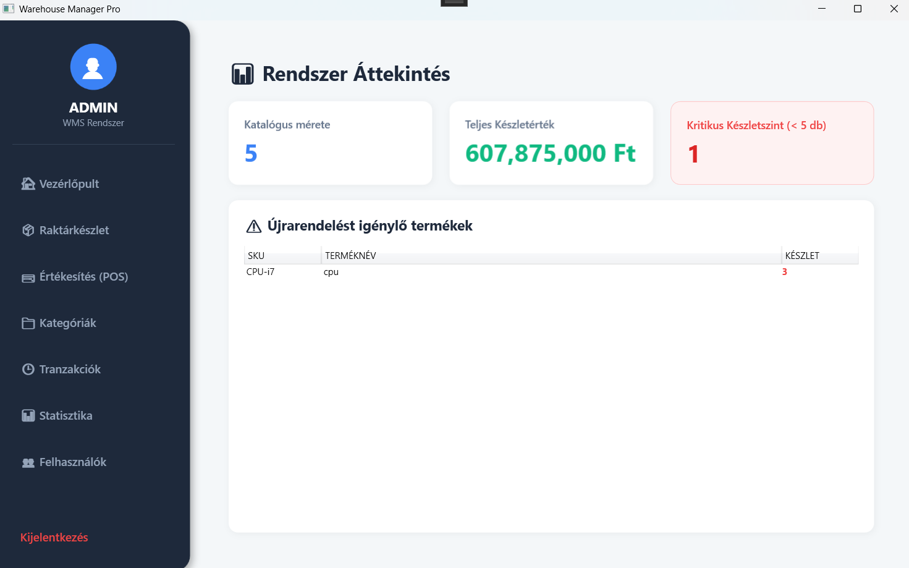
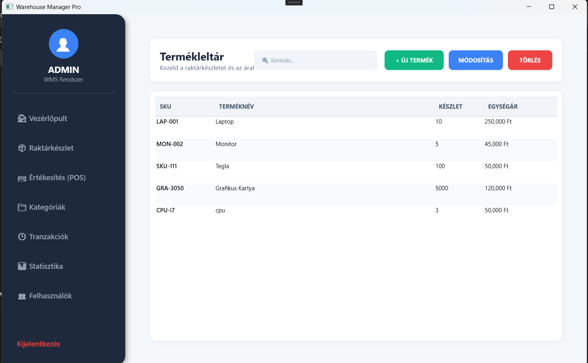

# \#  WMS PRO - Enterprise Warehouse \& POS Management System

# 

# !\[.NET Core](https://img.shields.io/badge/.NET-5C2D91?style=for-the-badge\&logo=.net\&logoColor=white)

# !\[C#](https://img.shields.io/badge/c%23-%23239120.svg?style=for-the-badge\&logo=c-sharp\&logoColor=white)

# !\[WPF](https://img.shields.io/badge/WPF-0078D4?style=for-the-badge\&logo=windows\&logoColor=white)

# !\[SQLite](https://img.shields.io/badge/sqlite-%2307405e.svg?style=for-the-badge\&logo=sqlite\&logoColor=white)

# !\[Entity Framework Core](https://img.shields.io/badge/EF\_Core-388E3C?style=for-the-badge\&logo=microsoft\&logoColor=white)

# 

# A modern, feature-rich Warehouse Management System (WMS) and Point of Sale (POS) desktop application built with \*\*C# WPF\*\* and \*\*Entity Framework Core\*\*. Designed with a clean, user-friendly UI and robust underlying architecture, this system streamlines inventory tracking, sales processing, and user management.

# 

# ---

# 

# \##  Key Features

# 

# \*  \*\*Secure Authentication \& Authorization:\*\* SHA-256 password encryption with Role-Based Access Control (RBAC). Differentiates between 'Admin' and 'User' privileges.

# \*  \*\*Interactive Dashboard:\*\* Real-time metrics including total inventory value, catalog size, and critical low-stock alerts.

# \*  \*\*Inventory Management:\*\* Full CRUD operations for products. Features instant search/filtering and category assignment.

# \*  \*\*Point of Sale (POS) \& Barcode Scanner Support:\*\* Fast checkout system. Supports physical barcode scanners via keyboard wedge (Enter-key capture) for rapid item scanning.

# \*  \*\*Automated PDF Invoicing:\*\* Generates professional, itemized PDF receipts dynamically upon successful checkout using `QuestPDF`.

# \*  \*\*Transaction History:\*\* Detailed logging of all sales with date-picker filtering for easy auditing.

# \*  \*\*User Management:\*\* Admins can promote/demote user roles and manage staff access dynamically.

# \*  \*\*Modern UI/UX:\*\* Built without third-party UI libraries. Utilizes pure WPF styling (ControlTemplates, DropShadows, rounded corners) for a sleek, modern, web-like desktop experience.

# 

# ---

# 

# \##  Screenshots

# 

# 

# 

# | Dashboard | Inventory Management |

# | :---: | :---: |

# |  |  |

# 

# | POS \& Barcode Scanner | PDF Receipt Generation |

# | :---: | :---: |

# |  |  |

# 

# ---

# 

# \##  Technology Stack \& Architecture

# 

# \* \*\*Frontend:\*\* C#, Windows Presentation Foundation (WPF), XAML

# \* \*\*Backend / Logic:\*\* .NET Core

# \* \*\*Architecture Pattern:\*\* MVVM (Model-View-ViewModel) - Ensuring clear separation of concerns, highly maintainable and testable code.

# \* \*\*Database:\*\* SQLite (Local database, requires no external server setup)

# \* \*\*ORM:\*\* Entity Framework Core (EF Core)

# \* \*\*PDF Generation:\*\* QuestPDF

# 

# ---

# 

# \##  Getting Started

# 

# \### Prerequisites

# \* Visual Studio 2022 (or newer)

# \* .NET 6.0 SDK (or newer)

# 

# \### Installation \& Run

# 

# 1\.  \*\*Clone the repository:\*\*

# &nbsp;   ```bash

# &nbsp;   git clone \[https://github.com/csongor2004/WarehouseManagerWPF](https://github.com/csongor2004/WarehouseManagerWPF)

# &nbsp;   ```

# 2\.  \*\*Open the Solution:\*\*

# &nbsp;   Open the `WarehouseManager.sln` file in Visual Studio.

# 3\.  \*\*Restore NuGet Packages:\*\*

# &nbsp;   Visual Studio should automatically restore the required packages (EF Core, QuestPDF). If not, right-click the solution and select "Restore NuGet Packages".

# 4\.  \*\*Run the Application:\*\*

# &nbsp;   Press `F5` or click "Start". 

# &nbsp;   \*Note: The application uses EF Core's `EnsureCreated()`. The SQLite database (`warehouse.db`) will be automatically generated in the `bin/Debug` folder upon the first launch.\*

# 

# \### Default Access

# Since the database is generated locally on your machine, you must \*\*Register\*\* a new account on the first startup. 

# \* \*\*The very first registered account\*\* automatically receives \*\*Admin\*\* privileges.

# \* Subsequent registrations will default to standard \*\*User\*\* privileges.

# 

# ---

# 

# \##  Author

# 

# \*\*\*\*

# \* GitHub: \[@csongor2004](https://github.com/csongor2004)

# \* LinkedIn: \[Csongor Török](www.linkedin.com/in/csongor-török-aa0a053b3)

# 

# If you like this project, feel free to leave a star!

